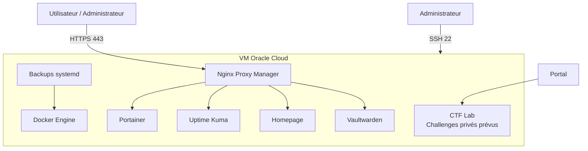

# Docker Secure Platform


Plateforme Docker sécurisée déployée sur Oracle Cloud Free Tier.

Ce projet met en place une plateforme auto-hébergée avec Docker Compose, Nginx Proxy Manager, HTTPS Let's Encrypt, supervision, sauvegardes automatisées et durcissement système.

---

## Objectif

L'objectif est de déployer une plateforme Docker complète et sécurisée sur une VM publique Oracle Cloud.

Le projet démontre :

- l'administration d'une VM Linux publique 
- le provisionnement cloud avec Terraform 
- l'installation automatisée avec Ansible 
- la gestion de services avec Docker Compose 
- la mise en place d'un reverse proxy HTTPS 
- la supervision de services web 
- la sauvegarde et la restauration de volumes Docker 
- la sécurisation d'un serveur exposé sur Internet 
- la validation automatique du projet avec GitHub Actions

---

## Stack technique

- Oracle Cloud Infrastructure Free Tier
- Ubuntu Server
- Terraform
- Ansible
- Docker
- Docker Compose
- Nginx Proxy Manager
- DuckDNS
- Let's Encrypt
- Portainer
- Uptime Kuma
- Homelab Portal FastAPI
- Vaultwarden
- UFW
- fail2ban
- systemd timers
- GitHub Actions
- Python
- CTF Lab privé

---
## Homelab Portal

Le projet inclut un portail interactif développé avec FastAPI.

Il affiche :

- l'état HTTP des services
- les liens rapides 
- le nombre de conteneurs actifs 
- l'utilisation disque 
- le dernier backup disponible 
- la liste des conteneurs Docker actifs

Le service est conteneurisé avec Docker et exposé uniquement via Nginx Proxy Manager.

## Homelab Portal

Le projet inclut un portail interactif développé avec FastAPI.

Il affiche :

- l'état HTTP des services 
- les liens rapides 
- le nombre de conteneurs actifs 
- l'utilisation disque 
- le dernier backup disponible 
- la liste des conteneurs Docker actifs

Le service est conteneurisé avec Docker et exposé uniquement via Nginx Proxy Manager.

## CTF Lab

Le projet inclut une section **CTF Lab** intégrée au Homelab Portal.

L'objectif est de préparer un espace privé dédié à des challenges de cybersécurité simples, pédagogiques et isolés.

Pour l'instant, aucun challenge vulnérable n'est exposé publiquement. La section CTF Lab sert à présenter les futurs challenges prévus.

Challenges prévus :

| Challenge | Catégorie | Difficulté | Statut |
|---|---|---|---|
| Linux Permissions | Linux | Easy | Planned |
| Log Analysis | Blue Team | Easy | Planned |
| Web Basics | Web | Easy | Planned |
| Docker Investigation | Docker | Medium | Planned |

La section CTF Lab est volontairement conçue comme un environnement privé. Les futurs challenges devront être isolés dans un réseau Docker dédié afin d'éviter tout impact sur les services principaux de la plateforme.

Objectifs pédagogiques :

- pratiquer les bases Linux 
- analyser des logs système 
- comprendre des comportements web simples 
- manipuler des environnements Docker isolés 
- documenter des scénarios de cybersécurité de manière contrôlée

Un endpoint API est également prévu :

```text
https://frikzai-home.duckdns.org/api/ctf
```

## Architecture

La plateforme est hébergée sur une VM Oracle Cloud publique.

Les services applicatifs ne sont pas exposés directement sur Internet. Ils sont accessibles uniquement via Nginx Proxy Manager en HTTPS.




## Aperçu

### Homepage


### Uptime Kuma


### Portainer


