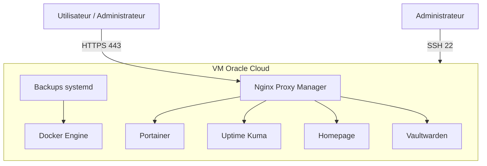
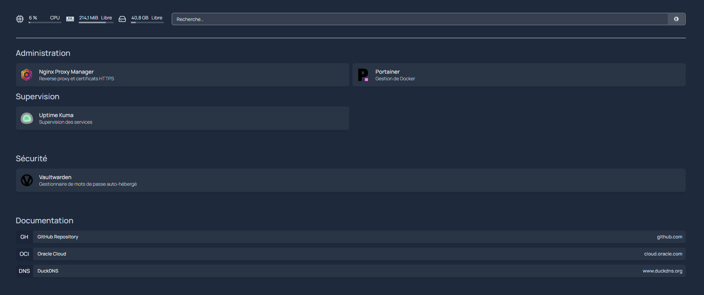
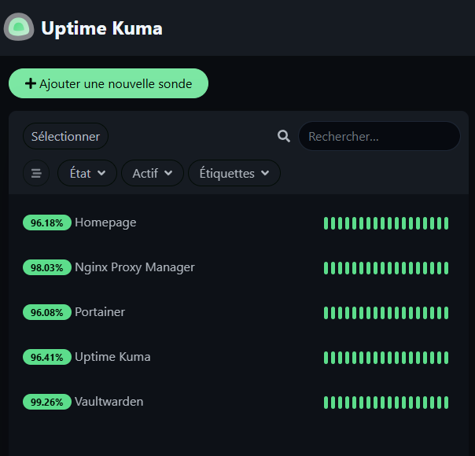
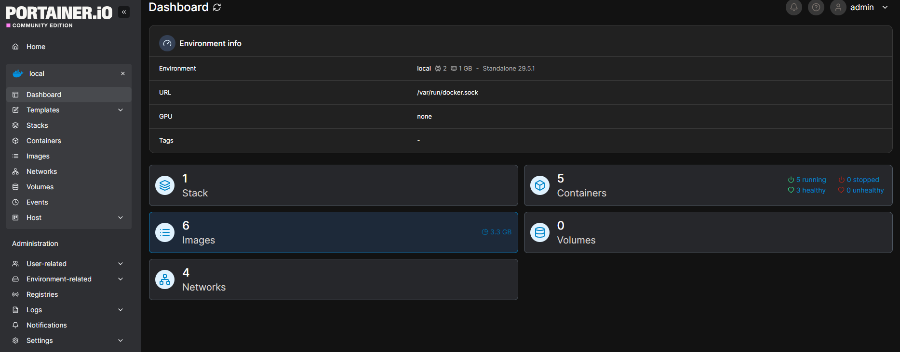

# Docker Secure Platform


Plateforme Docker sécurisée déployée sur Oracle Cloud Free Tier.

Ce projet met en place une plateforme auto-hébergée avec Docker Compose, Nginx Proxy Manager, HTTPS Let's Encrypt, supervision, sauvegardes automatisées et durcissement système.

---

## Objectif

L'objectif est de déployer une plateforme Docker complète et sécurisée sur une VM publique Oracle Cloud.

Le projet démontre :

- l'administration d'une VM Linux publique 
- le provisionnement cloud avec Terraform 
- l'installation automatisée avec Ansible 
- la gestion de services avec Docker Compose 
- la mise en place d'un reverse proxy HTTPS 
- la supervision de services web 
- la sauvegarde et la restauration de volumes Docker 
- la sécurisation d'un serveur exposé sur Internet 
- la validation automatique du projet avec GitHub Actions

---

## Stack technique

- Oracle Cloud Infrastructure Free Tier
- Ubuntu Server
- Terraform
- Ansible
- Docker
- Docker Compose
- Nginx Proxy Manager
- DuckDNS
- Let's Encrypt
- Portainer
- Uptime Kuma
- Homepage
- Vaultwarden
- UFW
- fail2ban
- systemd timers
- GitHub Actions

---

## Architecture

La plateforme est hébergée sur une VM Oracle Cloud publique.

Les services applicatifs ne sont pas exposés directement sur Internet. Ils sont accessibles uniquement via Nginx Proxy Manager en HTTPS.



```md
## Aperçu

### Homepage



### Uptime Kuma



### Portainer



